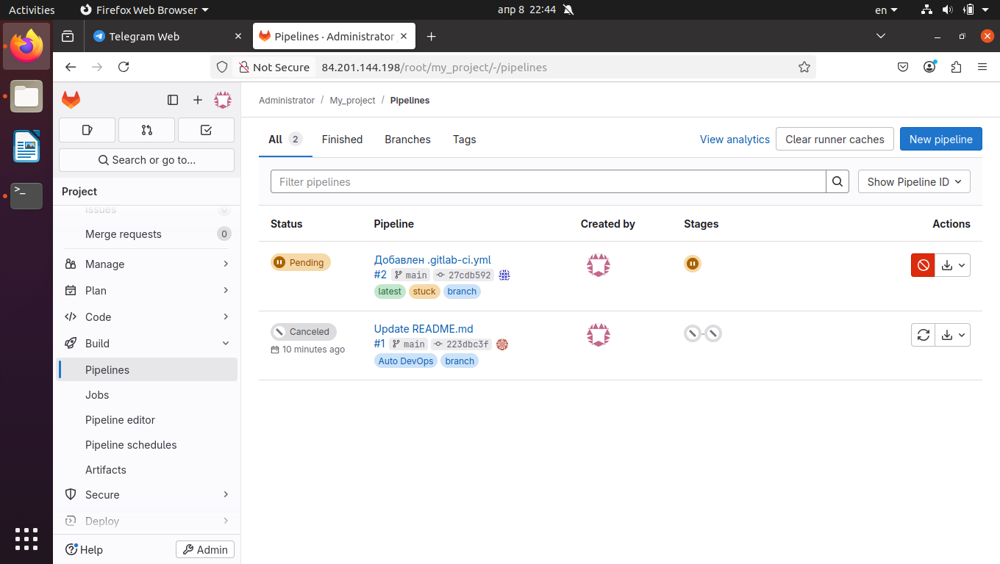

Домашнее задание 8.3

**Фамилия Имя:** Хомяков Антон

## Задание 1

🔹 Описание: Разворачиваем GitLab через Vagrant

🔹 Скриншот интерфейса GitLab:

🔹 Комментарии:
GitLab успешно развернут и доступен по адресу http://84.201.144.198/

## Дополнительные материалы для выполнения домашних заданий из блока "Введение в DevOps"

- [Дополнительный материал для занятия "8.2. Что такое DevOps. СI/СD"](CICD/8.2-hw.md)

- [Дополнительный материал для занятия "8.3. GitLab"](https://github.com/netology-code/sdvps-materials/tree/main/gitlab)

